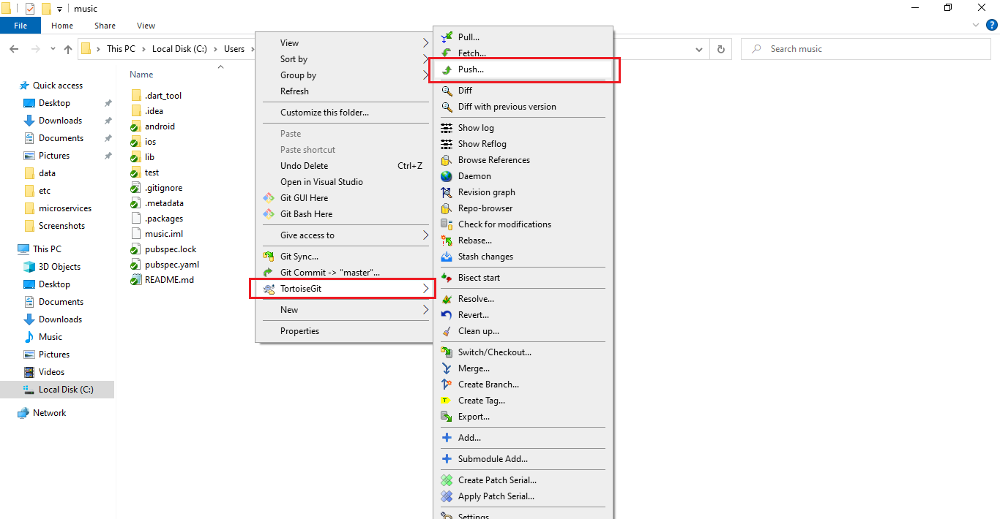

# HƯỚNG DẪN SỬ DỤNG GIT

#### Bước 1

#### Bước 2

#### Bước 3

#### Bước 4

#### Bước 5

#### Bước 6

#### Bước 7

#### Bước 8

#### Bước 9

#### Bước 10

#### Bước 11

#### Bước 12

#### Bước 13

#### Bước 14

#### Bước 15

#### Bước 16

#### Bước 17

