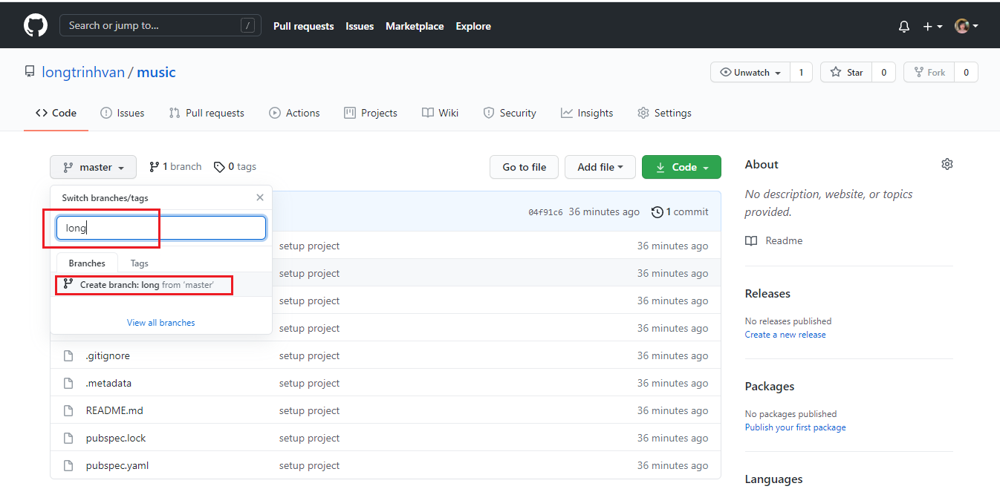

# HƯỚNG DẪN SỬ DỤNG GIT

#### Bước 1: ##### Tải và cài đặt Git Bash: https://git-scm.com/downloads

#### Bước 2: Tải và cài đặt Tortoisegit: https://tortoisegit.org/download/

#### Bước 3: Tạo repository trên máy tính cá nhân với Tortoisegit - Create repository here....

#### Bước 4: Chon OK 

#### Bước 5: Chọn OK

#### Bước 6: Commit code với Tortoisegit

#### Bước 7: Chọn close để kết thúc thao tác

#### Bước 8: Chọn Push

#### Bước 9: Tích chọn Push all branches và Arbitrary URL:

#### Bước 10: Chọn New repository

#### Bước 11: Đặt tên cho repository

#### Bước 12: Chọn Create repository

#### Bước 13: Copy HTTPS

#### Bước 14: Paste HTTPS vào Arbitrary URL: - sau đó chọn OK 

#### Bước 15: Chọn Yes

#### Bước 16: Chọn Close để kết thúc thao tác

#### Bước 17: Kiểm tra lại project trên github

#### Bước 18: create branch long

