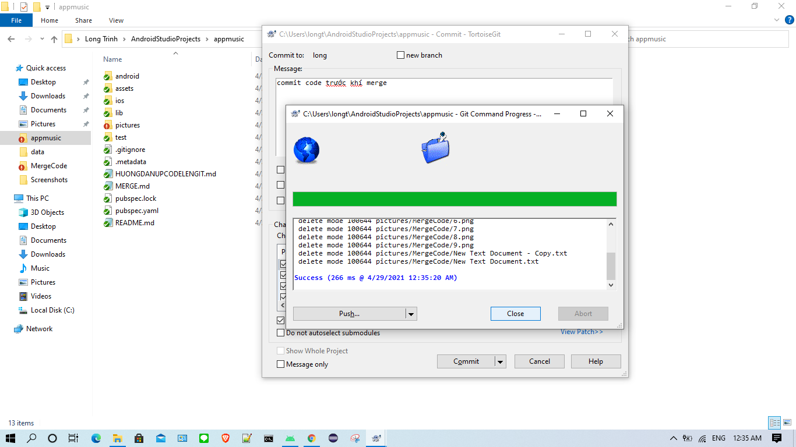
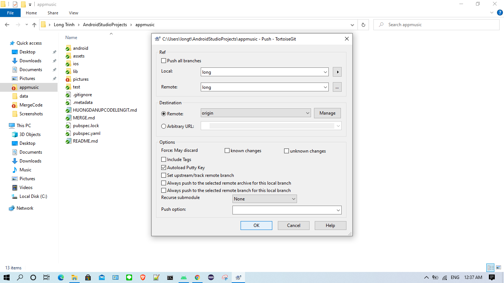
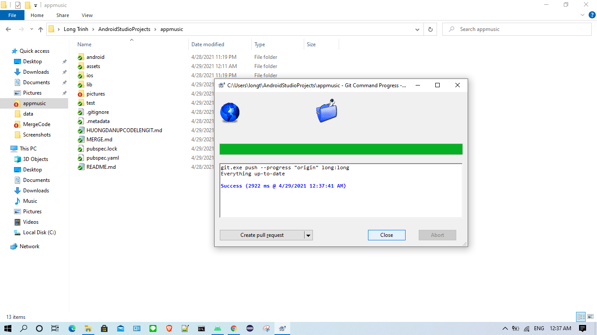
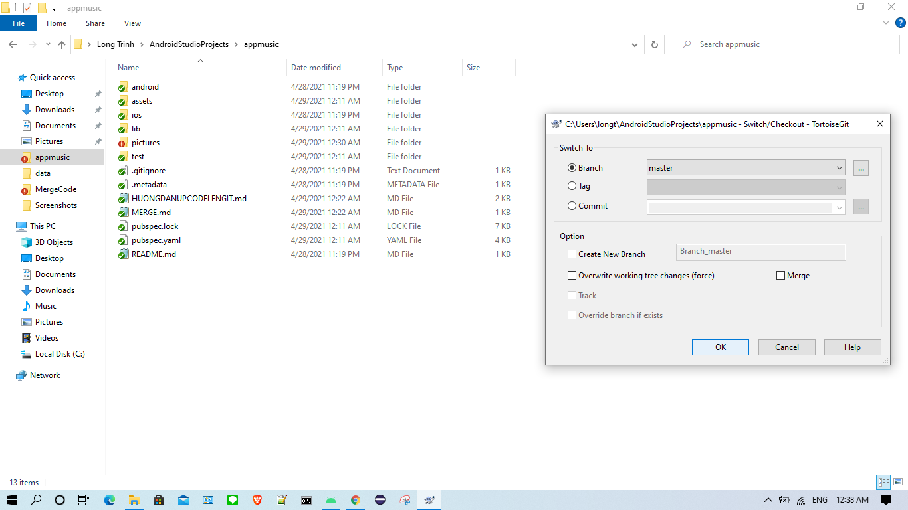
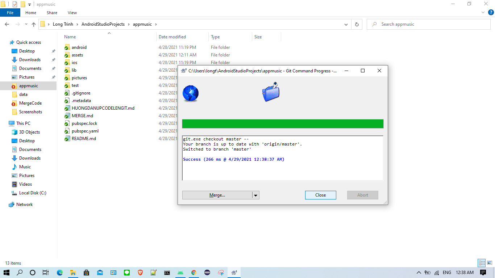

# CÁCH MERGE CODE TỪ BRANCHES long SANG BRANCHES master

**Bước 1:** **Commit** code lên **Branche long** trước khi **Merge**

**Bước 2:** Chọn **Commit**

**Bước 3:** Chọn **Close** 

**Bước 4:** **Push** code lên **Branche long** trước khi **Merge**

**Bước 5:** Chọn **OK**

**Bước 6:** Chọn **Close** 

**Bước 7:** Chọn **Switch/Checkout** để chuyển sang **Branche master**

**Bước 8:** Chọn **Branch master** sau đó nhấn **OK**

**Bước 9:** Chọn **Close** để hoàn thành chuyển sang **Branche master**

**Bước 10:** Chọn **Merge**

**Bước 11:** Chọn **Branch long** sau đó nhấn **OK**

**Bước 12:** Chọn **Close**

**Bước 13:** Chọn **Push**

**Bước 14:** Chọn **Branche master** sau đó nhấn **OK** và kiểm tra lại code trên **GitHub**

