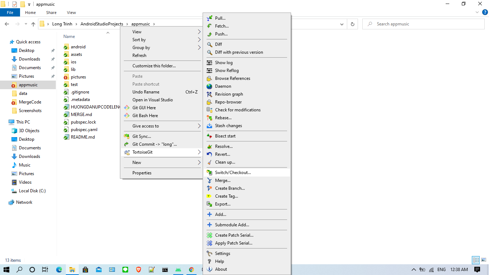
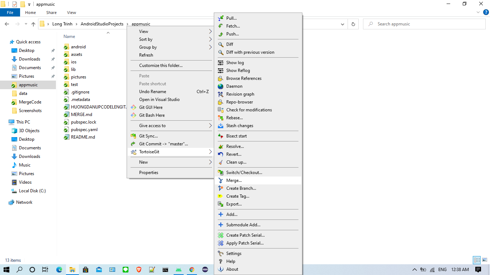

# CÁCH MERGE CODE TỪ BRANCHES long SANG BRANCHES master

**Bước 1:** 

**Bước 2:** 

**Bước 3:** 

**Bước 4:** 

**Bước 5:** 

**Bước 6:** 

**Bước 7:** 

**Bước 8:** 

**Bước 9:** 

**Bước 10:** 

**Bước 11:** 

**Bước 12:** 

**Bước 13:** 

**Bước 14:** 

